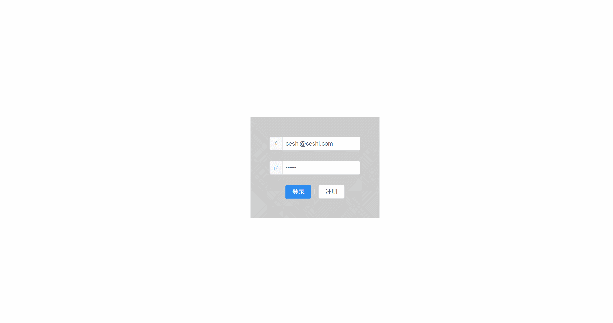

# vue 后台管理系统



## 介绍

基于 Vue CLI 一步一步实现一个后台管理系统前端部分， 后端部分（[Node 后台管理系统](https://gitee.com/hlshare/express_mongoDB)）

## 软件架构

基于 vue+vue-router+axios+iview，封装了 axios，功能点有：

邮箱验证、注册、登录、jwt 验证、用户管理、权限列表、角色列表、动态菜单、商品的增删改查、国际化管理（增删改查、批量添加、excel 导入导出、导出 js 文件）、图片上传等

### 结构

```sh
├── public/
└── src/
    ├── api/                       # 接口请求目录
    ├── assets/                    # 静态资源目录
    ├── components/                # 公共组件目录
    ├── libs/                      # 工具函数目录
    ├── router/                    # 路由配置目录
    ├── store/                     # 状态管理目录
    ├── views/                     # 页面组件目录
    ├── App.vue
    ├── main.js
├── .env.dev                       # 环境变量配置（开发环境本地启动）
├── .env.prod                      # 环境变量配置（生产环境打包）
├── .env.testdev                   # 环境变量配置（测试环境本地启动）
├── .env.testprod                  # 环境变量配置（测试环境打包）
├── vue.config.js                  # 项目配置文件
└── package.json
```

### 环境变量（如：.env.dev）

```sh
NODE_ENV = 'development'                        # 当前运行环境，'development'-开发环境 'production'-生产环境
VUE_APP_DESC = '开发环境'                        # 当前环境中文标识
VUE_APP_BASEURL = 'http://localhost:6166'       # 请求接口前缀
VUE_APP_PUBLICPATH = '/'                        # publicPath 运行路径前缀
```

## 安装教程

```sh
npm install
```

## 使用说明

```sh
npm run serve            # 开发环境本地运行，启用5155端口
npm run dev              # 开发环境本地运行，启用5155端口
npm run dev:test         # 测试环境本地运行，启用5155端口
npm run build            # 生产环境打包
npm run build:test       # 测试环境打包
npm run build            # 生产环境打包
```

## 更新日志

> 2022-3-1
> 1、目录结构调整，添加 views、store 文件夹
> 2、添加 vuex，使用 vuex-persistedstate 来持久化存储 token，menus
> 3、引入 compression-webpack-plugin，打包支持 gzip 压缩，优化首屏加载速度

> 2022-3-8
> 补充项目预览 GIF
